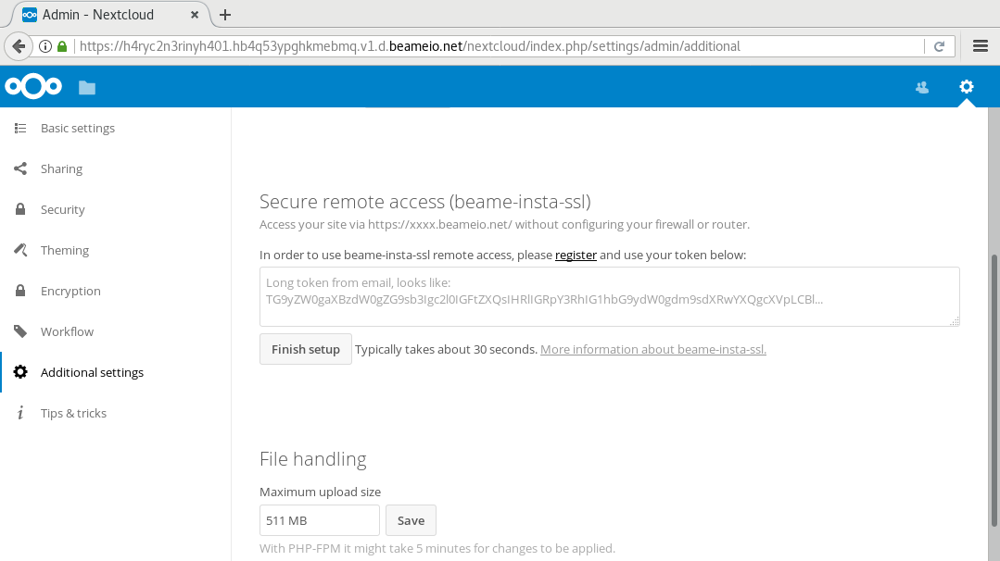
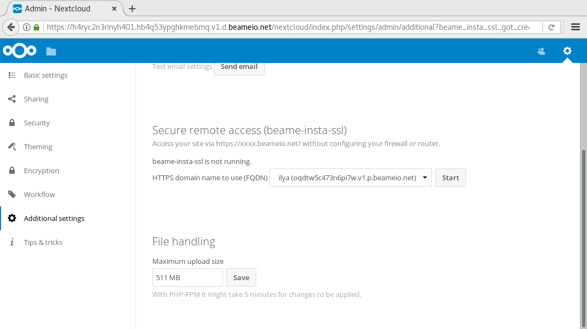
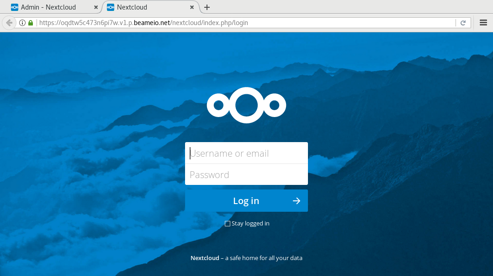

# beame-insta-ssl app

## Description

The beame-insta-ssl app provides an easy to use proxy connection for home servers. beame-insta-ssl makes your Nextcloud accessible from the Internet even if it is behind a firewall or router.

## Requirements

You must have [beame-insta-ssl npm](https://www.npmjs.com/package/beame-insta-ssl) installed globally (`sudo npm -g install beame-insta-ssl`).

## Screenshots

beame-insta-ssl npm is not installed:

Setting up:

Stopped:

Running:

Works:

beame-insta-ssl killed externally:

